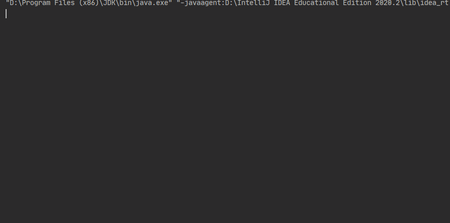

# Spotify Advisor 
A personal music advisor that makes preference-based suggestions and shares links to new releases and featured playlists.
# Features
To perform any actions other than authorization require the user has to be authorized with Spotify.

- `auth` Provides a link to the Spotify authorization page and waits until user confirms or rejects the authorization
- `new` Shows list of new albums with artists and links on Spotify
- `featured` Shows list of Spotify featured playlists with their links fetched from API
- `categories` Shows list of all available categories on Spotify (just their names)
- `playlists c_name` where c_name - name of category. List contains playlists of this category and their links on Spotify
# Technologies and concepts used
- Java 
- REST API
- JSON processing 
- MVC design pattern
# Demo

